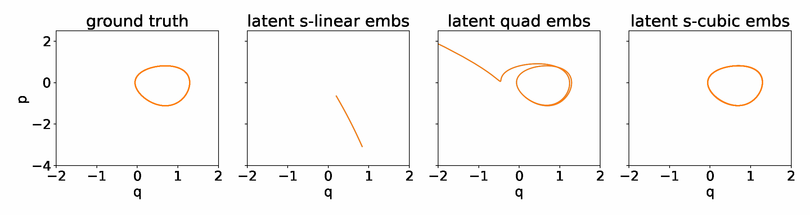

# Deep Learning for Structure-Preserving Universal Stable Koopman-Inspired Embeddings for Nonlinear Canonical Hamiltonian Dynamics

This repository contains the Python implementation using the PyTorch framework to learn Koopman-inspired linear embedding. It is based on the results presented in [1]. We have given a particular emphasis on learning structure-preserving embeddings via symplectic transformation. Furthermore, to overcome the difficulty of learning linear Koopman embeddings for systems with continuous spectrum, we learn cubic embeddings, which are built upon the lifting principles of dynamical systems. Furthermore, we have paid particular attention to the stability of the learned dynamics in the embedding space.




The important steps of the methodology are:

1. Collect measurement data  
2. Utilize parameterization for Hamiltonian functions for the embeddings, yielding Koopman-inspired linear or cubic embeddings 
3. Solve the optimization problem using gradient-decent to learn embedding as well as the corresponding Hamiltonian that can guarantee bounded stability
 	
For high-dimensional data, we utilize proper orthogonal decomposition to obtain a low-dimensional representation. Thereafter, we aim to learn full-spatial solutions using linear decoder, quadratic decoder, and convolution neural network-based decoder.


## Contains
* There are five examples (three low-dimensional and two high-dimensional examples), `Examples_*.py`, considered in the paper. The results generated from these examples will be saved in the ```Result``` folder. All examples can be run by using `run_examples.sh` which contains all configurations for all examples.
* The script ```transfer_figures_for_paper.sh``` extracts the figures from the folder ```Results``` that are used in the paper.

## Dependencies
For reproducibility, we have stored all dependencies and their versions in `environment.yml`. A virtual environment, namely `str_koopman_embs` can be created using `conda` by using `conda env create -f environment.yml`. Note that it is probably compatible with Linux machines only.

## License
See the [LICENSE](LICENSE) file for license rights and limitations (MIT).


## References
[1]. P. Goyal, S. Yildiz and P. Benner, [Deep Learning for Structure-Preserving Universal Stable Koopman-Inspired Embeddings for Nonlinear Canonical Hamiltonian Dynamics](https://arxiv.org/abs/2308.13835), arXiv:2308.13835, 2023.
<details><summary>BibTeX</summary><pre>
@TechReport{morGoyPB23,
  author =       {Goyal, P., Yildiz, S., and Benner, P.},
  title =        {Deep Learning for Structure-Preserving Universal Stable Koopman-Inspired Embeddings for Nonlinear Canonical Hamiltonian Dynamics},
  institution =  {arXiv},
  year =         2023,
  type =         {e-print},
  number =       {2308.13835},
  url =          {https://arxiv.org/abs/2308.13835},
}
</pre></details>

## Contact
For any further query, kindly contact [Pawan Goyal](mailto:goyalp@mpi-magdeburg.mpg.de). 